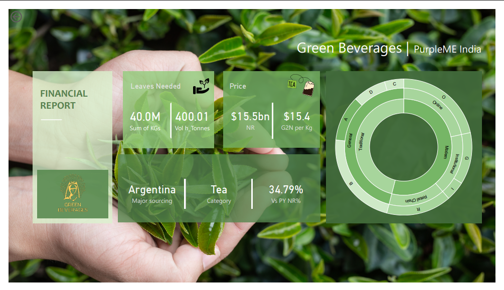

# 🥤 Green Beverages Financial Analytics Dashboard

An end-to-end **Power BI Business Intelligence project** analyzing Green Beverages' financial performance, customer segments, product sales, and revenue trends from **2018–2020**.

Designed to help business stakeholders monitor KPIs, identify growth opportunities, and make data-driven decisions through interactive dashboards.

---

# 📸 Dashboard Preview

## Executive Dashboard



---

## Sales & Customer Insights


---

## Revenue Performance


---

# 📊 Project Overview

This dashboard converts raw business data into actionable insights using **Power BI, Power Query, and DAX**.

The report focuses on:

- Executive KPI monitoring
- Revenue analysis
- Product performance
- Customer segmentation
- Geographic sourcing
- Time intelligence
- Business recommendations

---

# 📄 Report Pages

## 🏠 Executive Dashboard

- Executive KPIs
- Net Revenue
- Customer Overview
- Product Categories
- Supply Chain Summary
- Sourcing Analysis

---

## 👥 Sales & Customer Insights

- Customer Segmentation
- Product Performance
- Product Volume Analysis
- Geographic Insights
- Sales Analysis

---

## 📈 Revenue Performance

- Year-over-Year Revenue
- Quarterly Trends
- Monthly Performance
- Previous Year Comparison
- Revenue Growth Analysis

---

# 💡 Key Business Insights

- 💰 Generated **$15.5 Billion** in Net Revenue over three years.
- 🧾 Processed more than **81,000 customer transactions**.
- 👥 General customers contributed the largest share of revenue.
- ☕ Coffee Sachet was the highest-volume product.
- 📉 Revenue declined in 2019 before recovering in 2020.
- 🌍 Canada remained the primary sourcing country, indicating supply concentration risk.
- 📈 Revenue recovered by **3.93%** in 2020 after the previous year's decline.

---

# 🛠 Skills Demonstrated

- Power BI
- Power Query
- DAX
- Data Modeling
- ETL
- KPI Reporting
- Business Intelligence
- Data Visualization
- Time Intelligence
- Interactive Dashboards
- Drill-through
- Bookmarks
- Slicers
- Custom Visuals

---

# 📁 Repository Contents

```
Green-Beverages-PowerBI
│
├── Green Beverages.pbix
├── Green Beverages.xlsx
├── Green Beverages Financial Report.pdf
├── GreenBeverages_FinancialReport.pptx
├── README.md
│
└── Screenshots
    ├── overview.png
    ├── Sales & Customer.png
    └── Revenue Performance.png
```

---

# ⚙️ Tools Used

- Microsoft Power BI Desktop
- Microsoft Excel
- Power Query
- DAX

---

# 👨‍💻 Author

**Chirag Arora**

🎖 Microsoft Certified: Power BI Data Analyst Associate (PL-300)

LinkedIn: https://www.linkedin.com/in/chiragarora2002/
